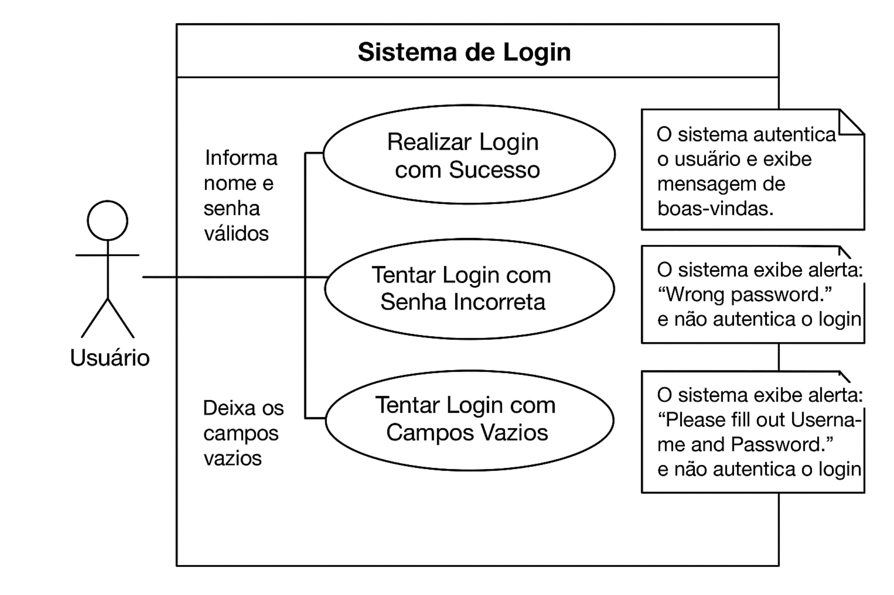

# Teste de Login com Cypress - DemoBlaze

Automação de testes E2E para validar o fluxo de login do site DemoBlaze.

---

## Tecnologias Utilizadas

- Node.js
- npm
- Cypress
- JavaScript

---

## Instalação e Execução

### Pré-requisitos

- Node.js: [https://nodejs.org/](https://nodejs.org/)
- npm (já incluso com Node.js)

### Passos

```bash
# Clonar repositório
git clone git@github.com:seu-usuario/ecommerce-login-test.git
cd ecommerce-login-test

# Instalar dependências
npm install

# Abrir interface interativa do Cypress
npm run cypress:open

# Executar testes em modo headless
npm test
```

---

## Estrutura de Pastas

```
/ecommerce-login-test
├─ /cypress
│   └─ /e2e
│       └─ login.cy.js
├─ /docs
│   └─ diagrama-login.png
├─ README.md

```

---

## Objetivo do Teste

Validar o fluxo de login de um usuário no site DemoBlaze, cobrindo cenários de sucesso e falha.

---

## Casos de Teste (Cenários)

| Cenário           | Passos                                             | Resultado Esperado                                       |
| ----------------- | -------------------------------------------------- | -------------------------------------------------------- |
| Login com sucesso | Preencher credenciais válidas e clicar em "Log in" | Redirecionamento para página inicial com nome do usuário |
| Senha incorreta   | Preencher senha incorreta e clicar em "Log in"     | Mensagem de erro exibida                                 |
| Campos vazios     | Clicar em "Log in" sem preencher campos            | Alerta de erro exibido                                   |

---

## Diagrama de Casos de Uso

Abaixo está o diagrama UML representando os principais fluxos do sistema de login testados com Cypress:

<p align="center">  </p>

---

## Critérios de Sucesso

- Todos os cenários de teste devem passar sem erros.

---

## Observações

- Os testes capturam screenshots automaticamente em cada cenário.
- A configuração do Cypress define `baseUrl`, `viewport` e timeouts para maior estabilidade.
- Futuramente, a execução pode ser integrada em pipelines de CI/CD.
